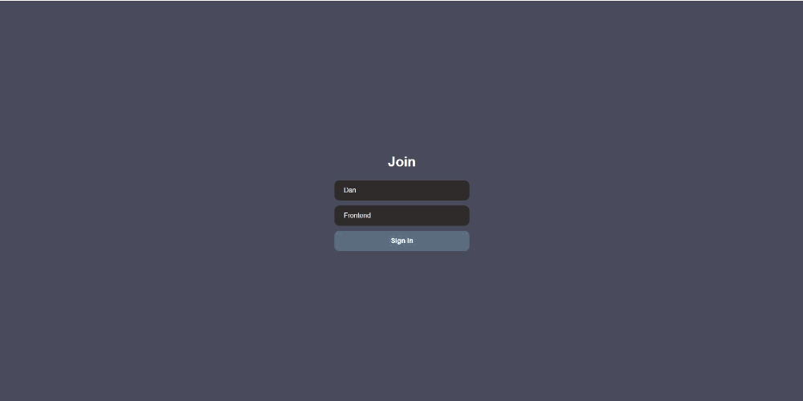

# **Приложения для заказа еды (SPA)**
 

___

## **Функционал приложения**
- Вход и выход в комнаты по названию
- Отправка и получение сообщений в реальном времени
- Возможность отправки смайликов

 
___

## **Запуск приложения**
> Перейти по ссылке: https://comfy-meringue-f8318b.netlify.app/
 
___

## Стек
- React JS.
- React Router для навигации между страницами
- Socket.io для обмена данными в реальном времени
___

## Демонстрация работы приложения
